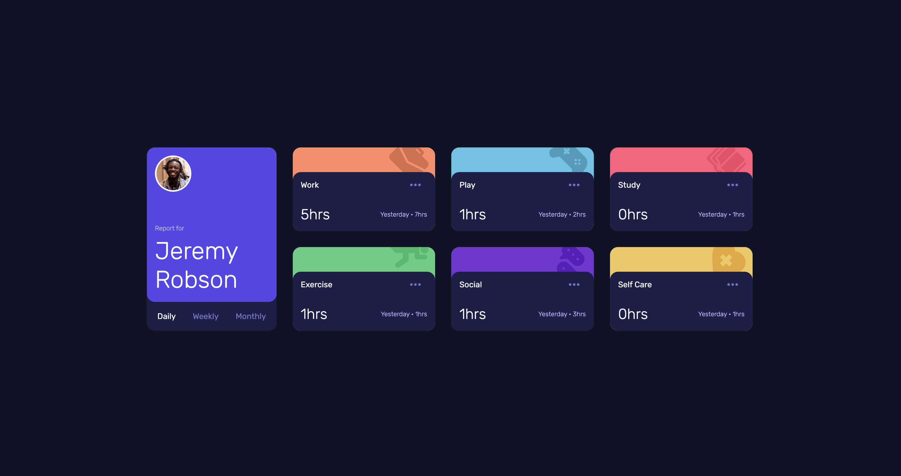

# Quiz 2 - Time tracking dashboard solution

This is a solution to the [Time tracking dashboard Quiz 2 challenge]

## Table of contents

- [Overview](#overview)
  - [The challenge](#the-challenge)
  - [Screenshot](#screenshot)
  - [Links](#links)
- [My process](#my-process)
  - [Built with](#built-with)
  - [What I learned](#what-i-learned)
  - [Continued development](#continued-development)
  - [Useful resources](#useful-resources)
- [Author](#author)

**Note: Delete this note and update the table of contents based on what sections you keep.**

## Overview

### The challenge

Users should be able to:

- View the optimal layout for the site depending on their device's screen size
- See hover states for all interactive elements on the page
- Switch between viewing Daily, Weekly, and Monthly stats

### Screenshot



### Links

- Solution URL: [Github Repo](https://github.com/Evvandra/time-tracking-dashboard-main)
- Live Site URL: [Live Site](https://your-live-site-url.com)

## My process

### Built with

- Semantic HTML5 markup
- CSS custom properties
- Flexbox
- CSS Grid
- [Styled Components](https://styled-components.com/) - For styles
- JavaScript - for all the panels and buttons

### What I learned

Use this section to recap over some of your major learnings while working through this project. Writing these out and providing code samples of areas you want to highlight is a great way to reinforce your own knowledge.

To see how you can add code snippets, see below:

```JS
async function fetchLiveData(){
  const data = await fetch('./data.json');
  const body = await data.json();
  const dailyData = body.map(type => (
    {
      time: type.timeframes.daily,
      title: type.title,
    }
  ))
  const weeklyData = body.map(type => (
    {
      time: type.timeframes.weekly,
      title: type.title,
    }
  ))
  const monthlyData = body.map(type => (
    {
      time: type.timeframes.monthly,
      title: type.title,
    }
  ))
  document.querySelector('#panel-container').innerHTML = generateCardHTMLString({
    daily: dailyData,
    weekly: weeklyData,
    monthly: monthlyData,
  })
}

fetchLiveData()
```
```css
@media screen and (min-width: 1024px) {
  .container--timecards {
    grid-template-columns: repeat(3, 1fr);
  }
}
```

### Continued development

In the future, I would like to working on my javascript as well with Jquery. since the code is significantly different from the most programming languanges I've learned. In addition, I also want to explore more about HTML and CSS because it would make our website more captivating and interactive.

### Useful resources

- [Gap in CSS](https://developer.mozilla.org/en-US/docs/Web/CSS/gap) - This helped me for gap in css. I really liked this pattern and will use it going forward.
- [Fetch JSON file in JS](https://www.freecodecamp.org/news/how-to-read-json-file-in-javascript/) - This is an amazing article which helped me finally understand fetch. I'd recommend it to anyone still learning this concept.

## Your Detail 

- FullName - Evandra Harya Putra
- StudentID - 2602118433
- BINUS Email - evandra.putra@binus.ac.id


## Submitting your solution

Submit your solution on links below depend on your class (remember each class has different due date)

* Submission link for class [L1AC](https://forms.office.com/r/JR157cR8nz) (only open on 6/1/2023 from 13:30 - 17:00)
* Submission link for class [L1BC](https://forms.office.com/r/6LGsa2siuJ) (only open on 6/1/2023 from 8:30 - 12:00)
* Submission link for class [L1CC](https://forms.office.com/r/FL0AZjSCNi) (only open on 5/1/2023 from 9:30 - 13:00)

**Have fun building!** 🚀
